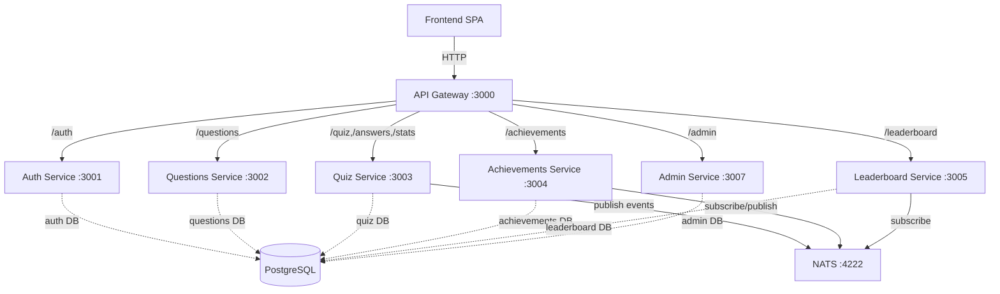
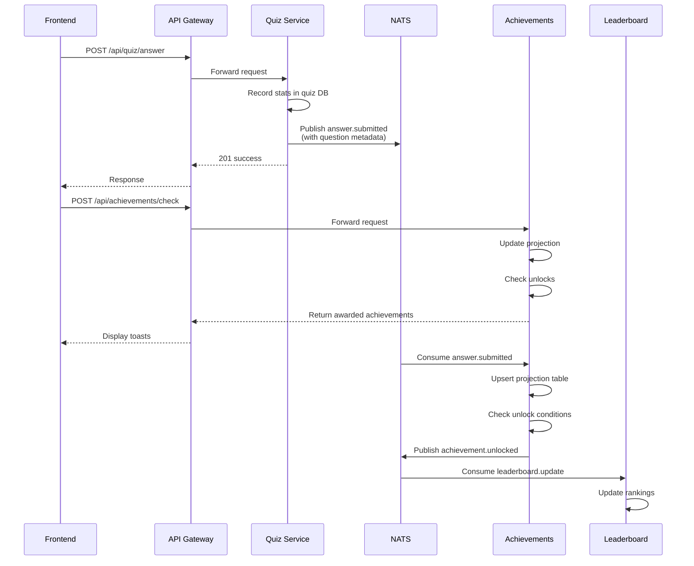
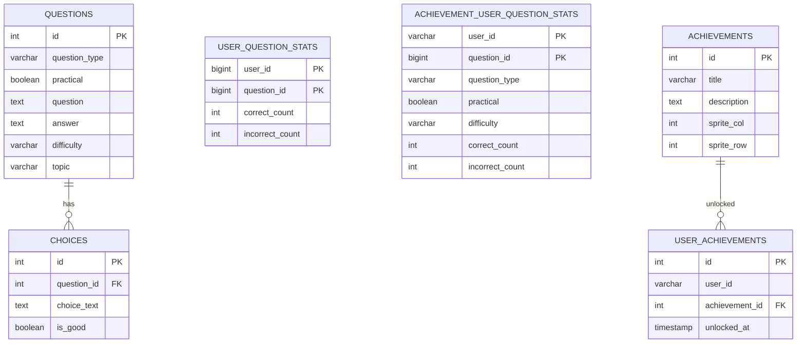

# Architecture Overview

## Service Architecture

## Event Flow

## Database Schema

## Services

| Service | Port | Purpose | DB |
|---------|------|---------|-----|
| frontend | 80/4200 | Angular SPA | - |
| api-gateway | 3000 | Routes /api/* to services | - |
| auth | 3001 | OAuth, JWT tokens | auth |
| questions | 3002 | Question/choice CRUD (read-only via API) | questions |
| quiz | 3003 | Answer submission, stats, quiz modes | quiz |
| achievements | 3004 | Achievement unlock checks, user progress | achievements |
| leaderboard | 3005 | Leaderboard rankings | leaderboard |
| admin | 3007 | Admin panel: question/user CRUD | admin |
| maintenance | 3010 | Schema migrations | all DBs |
| nats | 4222 | Event broker | - |
| postgres | 5432 | PostgreSQL server | multiple DBs |

## Databases

### auth
- `users` (id, name, email, google_id, created_at, updated_at)

### questions
- `questions` (id, question_type, practical, question, answer, quiz, match_keywords[], difficulty, topic, is_active, created_at, updated_at)
- `choices` (id, question_id, choice_text, is_good, explanation)

### quiz
- `user_question_stats` (user_id, question_id, correct_count, incorrect_count) PK: (user_id, question_id)
- `quiz_modes` (id, name, description, filters)

### achievements
- `achievements` (id, title, description, sprite_col, sprite_row, created_at)
- `user_achievements` (id, user_id, achievement_id, unlocked_at)
- `achievement_user_question_stats` (user_id, question_id, question_type, practical, difficulty, correct_count, incorrect_count, last_answered_at) PK: (user_id, question_id) — **local projection from events**

### leaderboard
- `leaderboards` (id, user_id, username, quiz_mode_id, correct_answers, total_answers, score, last_updated)
- `users` (id, name, email, google_id, created_at, updated_at)

### admin
- `users` (id, name, email, google_id, created_at, updated_at)

## REST Endpoints

### api-gateway (proxies to services)
- `GET /api/auth/google` → auth
- `GET /api/auth/google/callback` → auth
- `GET /api/auth/user` → auth
- `GET /api/questions` → questions
- `GET /api/questions/:id` → questions
- `GET /api/questions/random` → questions
- `GET /api/quiz/modes` → quiz
- `POST /api/quiz/answer` → quiz
- `GET /api/answers/:questionId` → quiz (returns correct answer)
- `POST /api/stats/record` → quiz
- `GET /api/stats/user/:userId` → quiz
- `GET /api/stats/user/:userId/wrong-questions` → quiz
- `GET /api/achievements` → achievements
- `GET /api/achievements/user/:userId` → achievements
- `POST /api/achievements/check` → achievements (sync unlock)
- `GET /api/leaderboard/:modeId` → leaderboard
- `POST /api/leaderboard` → leaderboard
- `GET /api/admin/users` → admin
- `GET /api/admin/questions` → admin
- `POST /api/admin/questions` → admin
- `PUT /api/admin/questions/:id` → admin
- `DELETE /api/admin/questions/:id` → admin

## NATS Events

### Published by quiz service
- `answer.submitted` — payload: `{ userId, questionId, selectedChoiceId, quizModeId, isCorrect, questionType, practical, difficulty, timestamp, correlationId }`
- `achievement.check` — payload: `{ userId, questionId, quizModeId, correlationId }`
- `leaderboard.update` — payload: `{ userId, quizModeId, correlationId }`
- `answer.submission.failed` — payload: `{ userId, questionId, error, correlationId }`

### Published by achievements service
- `achievement.unlocked` — payload: `{ userId, achievementId, achievementTitle, eventType, timestamp, serviceId }`

### Consumed by achievements service
- `answer.submitted` → updates `achievement_user_question_stats` projection, runs unlock checks, publishes `achievement.unlocked` events

### Consumed by leaderboard service
- `leaderboard.update` → recalculates rankings for quiz mode

## Cross-DB Access

**Maintenance service**:
- Runs schema migrations and table checks across all databases

## Event-Driven Flows

### Answer Submission Flow
1. Frontend → POST /api/quiz/answer
2. Quiz service records stats in quiz.user_question_stats
3. Quiz publishes `answer.submitted` (with question metadata)
4. Achievements consumes event → upserts `achievement_user_question_stats` → checks unlocks → publishes `achievement.unlocked`
5. Leaderboard consumes `leaderboard.update` → updates rankings

### Synchronous Achievement Check (for UI toast)
1. Frontend → POST /api/achievements/check (after answer submission)
2. Achievements updates projection, checks unlocks, returns awarded achievements
3. Frontend displays toast notifications

## Notes

- Achievements projection (`achievement_user_question_stats`) removes cross-DB dependency by maintaining local stats from events
- Admin manages questions through questions service endpoints
- Quiz reads question metadata/answers through questions service endpoints
- All runtime services use a single DB; only maintenance performs cross-DB operations
