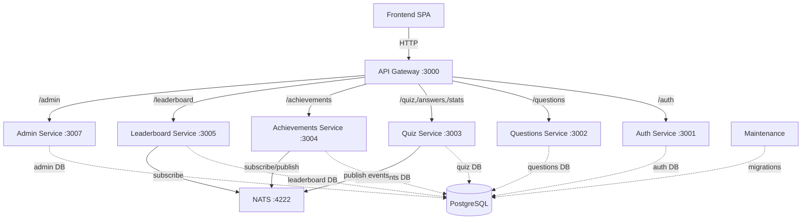
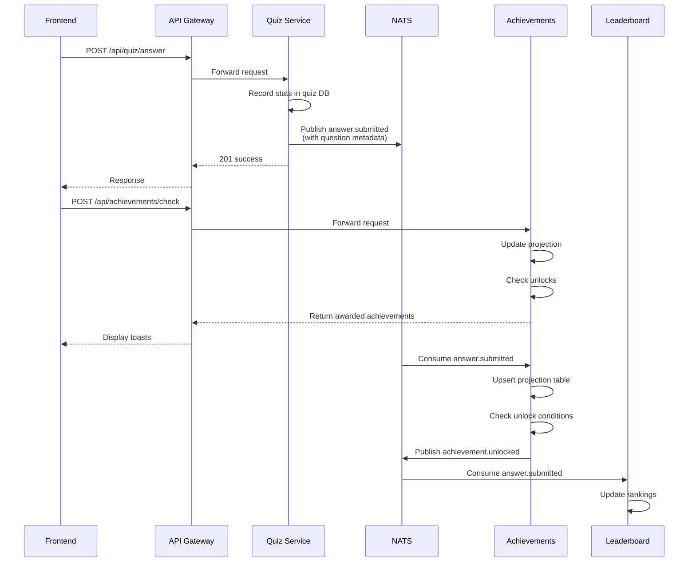
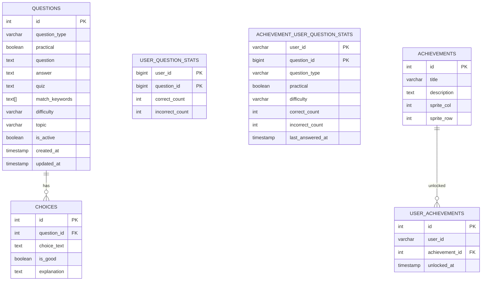
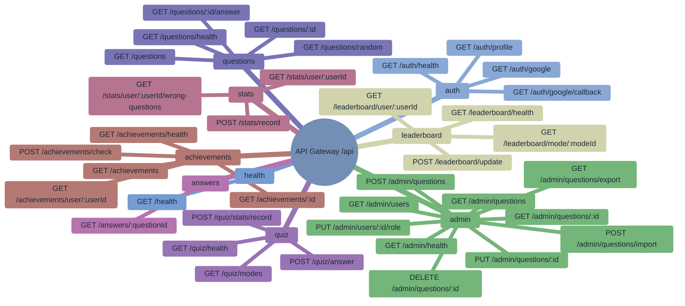

# Node-Learn

A full-stack **Node.js Interview Questions Learning Platform** built with NestJS backend, Angular frontend, and PostgreSQL database.

## Overview

Node-Learn is a quiz platform where users can:
- Take quizzes on Node.js interview questions
- Track their progress and statistics
- Earn achievements and badges
- Compete on leaderboards
- Search and filter questions by topic, difficulty, and type

## Architecture Overview

## Service Architecture



## Event Flow



## Database Schema



## Services

| Service | Port | Purpose | DB |
|---------|------|---------|-----|
| frontend | 80/4200 | Angular SPA | - |
| api-gateway | 3000 | Routes /api/* to services | - |
| auth | 3001 | OAuth, JWT tokens | auth |
| questions | 3002 | Question/choice CRUD (read-only via API) | questions |
| quiz | 3003 | Answer submission, stats, quiz modes | quiz |
| achievements | 3004 | Achievement unlock checks, user progress | achievements |
| leaderboard | 3005 | Leaderboard rankings | leaderboard |
| admin | 3007 | Admin panel: question/user CRUD | admin |
| maintenance | 3010 | Schema migrations | all DBs |
| nats | 4222 | Event broker | - |
| postgres | 5432 | PostgreSQL server | multiple DBs |

## REST Endpoints

### api-gateway (proxies to services)


Note: In K8s, OAuth routes may bypass the gateway via ingress, so the `/api` prefix is not always used for auth endpoints.

## NATS Events

### Published by quiz service
- `answer.submitted` — payload: `{ userId, questionId, selectedChoiceId, quizModeId, isCorrect, questionType, practical, difficulty, timestamp, correlationId }`
- `achievement.check` — payload: `{ userId, questionId, quizModeId, correlationId }`
- `leaderboard.update` — payload: `{ userId, quizModeId, correlationId }`
- `answer.submission.failed` — payload: `{ userId, questionId, error, correlationId }`

### Published by achievements service
- `achievement.unlocked` — payload: `{ userId, achievementId, achievementTitle }`

### Published by auth service
- `user.login` — payload: `{ userId, googleId, email, name, isAdmin, provider }`

### Published by admin service
- `question.created` — payload: `{ correlationId, timestamp, data }`
- `question.updated` — payload: `{ correlationId, timestamp, data }`
- `question.deleted` — payload: `{ correlationId, timestamp, data }`
- `user.role.updated` — payload: `{ correlationId, timestamp, data }`

### Consumed by achievements service
- `answer.submitted` → updates `achievement_user_question_stats` projection, runs unlock checks, publishes `achievement.unlocked` events

### Consumed by leaderboard service
- `answer.submitted` → updates rankings
- `user.login` → syncs user profile

## Cross-DB Access

**Maintenance service**:
- Runs schema migrations and table checks across all databases

## Event-Driven Flows

### Answer Submission Flow
1. Frontend → POST /api/quiz/answer
2. Quiz service records stats in quiz.user_question_stats
3. Quiz publishes `answer.submitted` (with question metadata)
4. Achievements consumes event → upserts `achievement_user_question_stats` → checks unlocks → publishes `achievement.unlocked`
5. Leaderboard consumes `leaderboard.update` → updates rankings

### Synchronous Achievement Check (for UI toast)
1. Frontend → POST /api/achievements/check (after answer submission)
2. Achievements updates projection, checks unlocks, returns awarded achievements
3. Frontend displays toast notifications

## Notes

- Achievements projection (`achievement_user_question_stats`) removes cross-DB dependency by maintaining local stats from events
- Admin manages questions through questions service endpoints
- Quiz reads question metadata/answers through questions service endpoints
- All runtime services use a single DB; only maintenance performs cross-DB operations

## Configuring

Copy .env.example to .env and fill in required values:
```bash
cp .env.example .env
```

## Installing dependencies

```bash
npm run install:all
```

## Building docker images

```bash
npm run build:all
```

## Starting in development mode

Run backend services (Docker) and frontend dev server together:
```bash
Cmd+Shift+B  →  Select "Dev: All Services"
```

This starts:
- **Backend:** Docker services (PostgreSQL, NATS, microservices) with hot reload
- **Frontend:** Angular dev server on port 4200 with hot reload

## Starting

Start all backend services and frontend dev server:
```bash
npm run start
```

Optional health check:
```bash
./scripts/health.sh
```

## Deploying

Deploy all services to your current cluster context:
```bash
./k8s/scripts/deploy.sh
```

Optional verification:
```bash
./k8s/scripts/test-k8s.sh
```